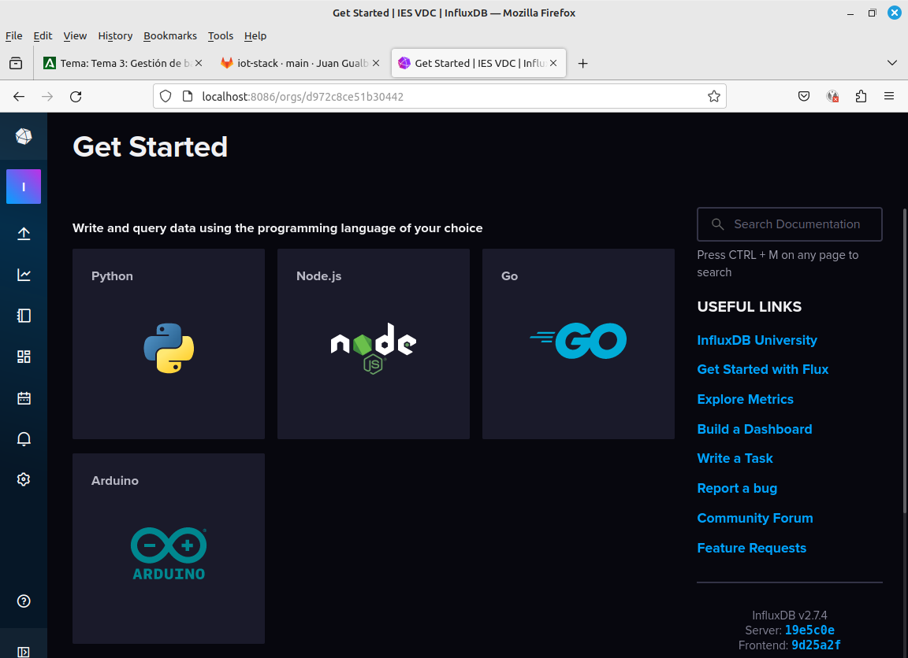
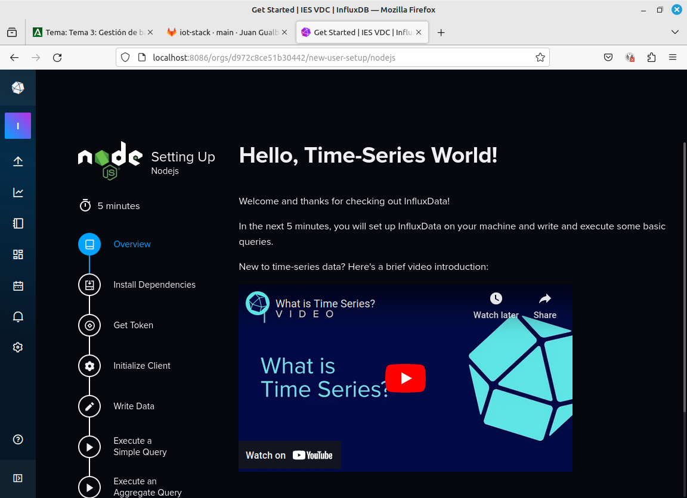

# Preparación del entorno


## La pila MING

Como punto de partida usaremos el siguiente repositorio para montar nuestro ecosistema de servicios necesario para el proyecto: <https://github.com/emield12/docker-influxdb-grafana-nodered-mqtt>. Recuerda que existe una copia en local enel repositorio de estos apuntes, en la carpeta **iot-stack**.

Arrancamos los contenedores con (en Windows abrimos una Git Bash terminal en la carpeta **iot-stack**, previamente hemos abierto Docker Desktop para que arranque el servicio):

```bash
bash run.sh
```

Para parar los contenedores:

```bash
docker-compose down
```

Una vez creados, podemos arrancarlos todos a la vez desde esta misma carpeta con:

```bash
docker-compose start
```

Ya podemos abrir la página de InfluxDB: <http://localhost:8086/>. Pulstamos en "Get Started". Ahora configuramos InfluxDB con estos parámetros:

Parámetro | Valor
----------|------
Username | root
Password | Secreto_123
Confirm Password | Secreto_123
Initial Organization Name | IES VDC
Initial Bucket Name | Ambiente

En la siguiente pantalla, nos aseguramos de copiar el token y guardarlo en un fichero de texto. He creado una carpeta **"credentials"** que añado al **.gitignore** y ahora en un archivo influx.token guardo el token copiado.

El **.gitignore** quedaría así de momento:

```git
credentials/
node_modules/
```

La barra al final quiere decir que en cualquier subcarpeta del proyecto que contenga una carpeta con estos nombres, será ignorada y no subida al repositorio.

Para confirmar los cambios y subirlos al repo, recuerda que puedes hacer (previamente debiste haber creado el repositorio en Github/Gitlab):

```bash
git add .
git commit -m "creado gitignore"
git push origin main
```

Si nos habíamos equivocado y añadido el "node_modules" y el "credentials" puedo hacer: 

```bash 
git rm --cached -r .
```

Para empezar de nuevo.

De los tres botones que salen en la ventana de bienvenida, ahora vamos a hacer el tutorial pulsando en "Quick Start".



En la ventana pulsamos en **Node.js**.



Creamos en la raíz de nuestro proyecto una carpeta **"node"**, en esa carpeta vamos a crear el código y a completar el tutorial. 

**Paso 1: Instalar las dependencias**

```bash 
npm install --save @influxdata/influxdb-client
```

**Paso 2: variables de entorno**

En Windows usamos git bash para ejecutar este comando:

```bash 
export INFLUXDB_TOKEN=$(cat ../credentials/influx.token)
```

**Paso 3: Conexión a la BBDD**

Ejecuto el comando "node" desde la carpeta que hicimos npm install:

```javascript 
const {InfluxDB, Point} = require('@influxdata/influxdb-client')
const token = process.env.INFLUXDB_TOKEN
const url = 'http://localhost:8086'
const client = new InfluxDB({url, token})
```

**Paso 4: inserción de datos**

Copia el contenido de este ejemplo a un archivo con extensión **js** y puedes ejecutarlo desde NodeJS en la carpeta donde hicimos el comando "npm install" para que estén todas las librerías necesarias. 

```javascript

const {InfluxDB, Point} = require('@influxdata/influxdb-client')

const org= 'IES VDC';
let bucket = `ambiente`
const token = process.env.INFLUXDB_TOKEN
const url = 'http://localhost:8086'

const client = new InfluxDB({url, token})


let writeClient = client.getWriteApi(org, bucket, 'ns')

for (let i = 0; i < 5; i++) {
  let point = new Point('measurement1')
    .tag('tagname1', 'tagvalue1')
    .intField('field1', i)

  void setTimeout(() => {
    writeClient.writePoint(point)
  }, i * 1000) // separate points by 1 second

  void setTimeout(() => {
    writeClient.flush()
  }, 5000)
}

```

**Paso 5: Consulta a la BBDD** 

```javascript

const {InfluxDB, Point} = require('@influxdata/influxdb-client')

const org= 'IES VDC';
const token = process.env.INFLUXDB_TOKEN
const url = 'http://localhost:8086'

const client = new InfluxDB({url, token})

let queryClient = client.getQueryApi(org)

let fluxQuery = `from(bucket: "ambiente")
 |> range(start: -30d)
 |> filter(fn: (r) => r._measurement == "measurement1")`


queryClient.queryRows(fluxQuery, {
  next: (row, tableMeta) => {
    const tableObject = tableMeta.toObject(row)
    console.log(tableObject)
  },
  error: (error) => {
    console.error('\nError', error)
  },
  complete: () => {
    console.log('\nSuccess')
  },
})

```
\pagebreak
