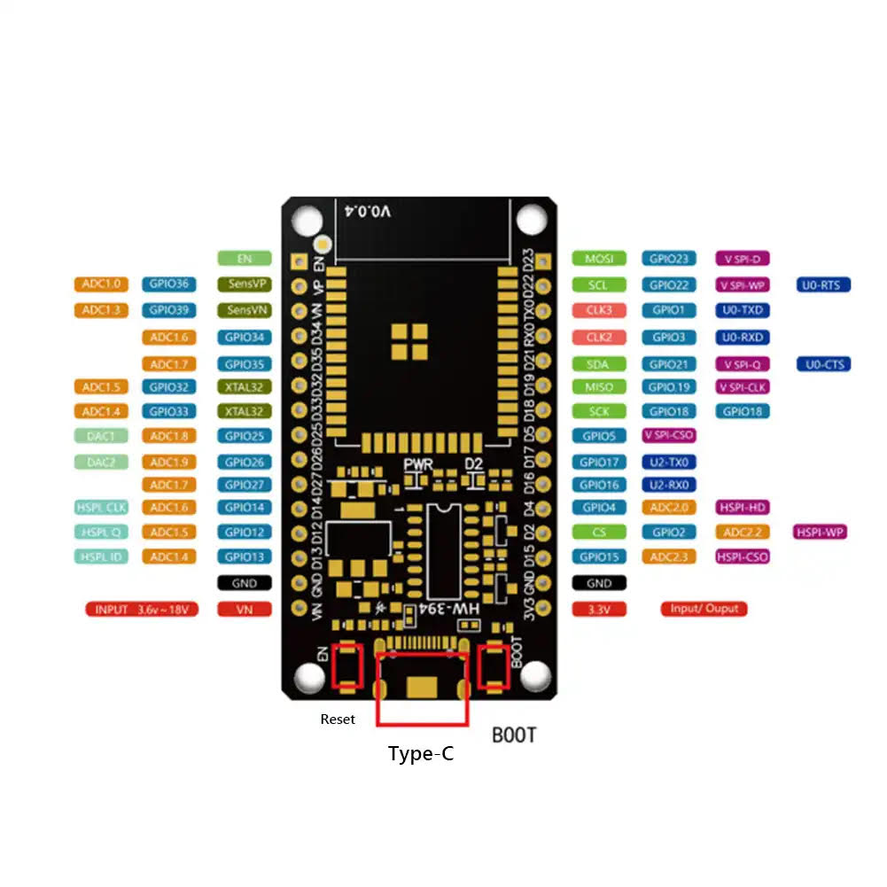
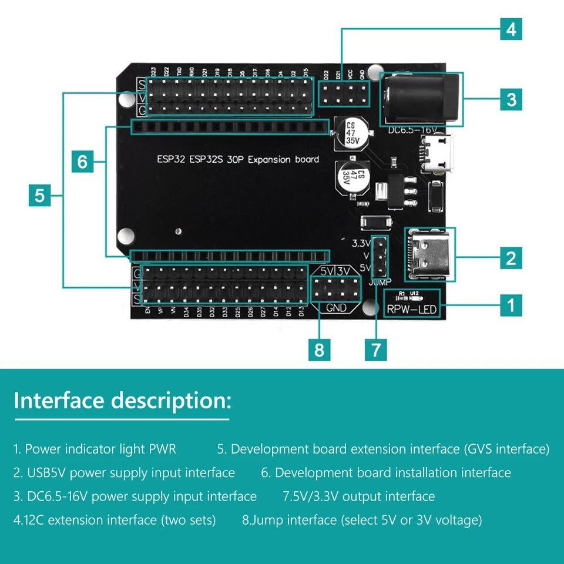

# Configurando un hardware de ejemplo

## ESP32 Wroom

La placa de desarrollo o DEVKIT V1 NodeMCU-32 es una herramienta muy potente para el prototipado rápido de proyectos con IoT (Internet de la cosas). Integra en una placa el SoM ESP-WROOM-32 que tiene como base al SoC ESP32, el convertidor USB-serial Ch340G necesario para programar por USB el ESP32, reguladores de voltaje y leds indicadores.

La plataforma ESP32 es la evolución del ESP8266 mejorando sus capacidades de comunicación y procesamiento computacional. A nivel de conectividad permite utilizar diversos protocolos de comunicación inalámbrica como: WiFi, Bluetooth y BLE.

En cuanto a procesamiento su CPU 32-bit de dos núcleos de hasta 240Mhz que se pueden controlar independientemente. Además incluye internamente una gran cantidad de periféricos para la conexión con: sensores táctiles capacitivos, sensor de efecto Hall, amplificadores de bajo ruido, interfaz para tarjeta SD, Ethernet, SPI de alta velocidad, UART, I2S e I2C. Aplicado en Mini Servidores Web, Procesamiento digital, Webcams, Cámara IP, Robótica móvil, Domótica y más.

NodeMCU-32 está diseñada especialmente para trabajar montado en protoboard. Puede alimentarse directamente del puerto micro-USB o utilizando una fuente externa de 5V o 3V pues posee regulador de voltaje en placa, recomendamos utilizar una fuente de 5VDC/1A y colocar un capacitor de 100uF en paralelo con la fuente de alimentación para filtrar los picos de corriente.

Los pines de entradas/salidas (GPIO) trabajan a 3.3V por lo que para conexión a sistemas de 5V es necesario utilizar conversores de nivel como: Conversor de nivel 3.3-5V 4CH o Conversor de nivel bidirecional 8CH - TXS0108E.

El SoC(System On a Chip) ESP32 de Espressif Systems es la evolución del ESP8266, diseñado para superar a su antecesor en capacidad de procesamiento y conectividad, integra un potente microcontrolador con arquitectura de 32 bits, conectividad Wi-Fi y Bluetooth. El SoM(System on Module) ESP-WROOM-32 fabricado por Espressif integra en un módulo el SoC ESP32, memoria FLASH, cristal oscilador y antena WiFi en PCB.

La plataforma ESP32 permite el desarrollo de aplicaciones en diferentes lenguajes de programación, frameworks, librerías y recursos diversos. Los más comunes a elegir son: Arduino(en lenguaje C++), MicroPython, LUA, Esp-idf(Espressif IoT Development Framework) desarrollado por el fabricante del chip, Simba Embedded Programming Platform(en lenguaje Python), RTOS's (como Zephyr Project, Mongoose OS, NuttX RTOS), Javascript (Espruino, Duktape, Mongoose JS), Basic. Al trabajar dentro del entorno Arduino podremos utilizar un lenguaje de programación conocido y hacer uso de un IDE sencillo de utilizar, además de hacer uso de toda la información sobre proyectos y librerías disponibles en internet.

La comunidad de usuarios de Arduino es muy activa y da soporte a plataformas como el ESP32 y ESP8266. Dentro de las principales placas de desarrollo o módulos basados en el ESP32 tenemos: ESP32-WROOM-32, NodeMCU-32 ESP32 y ESP32-CAM y de la familia ESP8266 tenemos: ESP-01, ESP-12E, Wemos D1 mini y NodeMCU v2.

ESPECIFICACIONES Y CARACTERÍSTICAS

- Voltaje de Alimentación (USB): 5V DC
- Voltaje de Entradas/Salidas: 3.3V DC
- Placa: ESP32 DEVKIT V1 (Espressif)
- SoM: ESP-WROOM-32 (Espressif)
- SoC: ESP32 (ESP32-D0WDQ6)
- CPU: Dual-Core Tensilica Xtensa LX6 (32 bit)
- Frecuencia de Reloj: hasta 240Mhz
- Desempeño: Hasta 600 DMIPS
- Procesador secundario: Permite hacer operaciones básica en modo de ultra bajo consumo
Wifi: 802.11 b/g/n/e/i (802.11n @ 2.4 GHz hasta 150 Mbit/s)
- Bluetooth: v4.2 BR/EDR and Bluetooth Low Energy (BLE)
Memoria:
448 KByte ROM
520 KByte SRAM
16 KByte SRAM in RTC
QSPI Flash/SRAM, 4 MBytes
- Pines: 30
- Pines Digitales GPIO: 24 (Algunos pines solo como entrada)
- Pines PWM: 16
- Pines Analógicos ADC: 18 (3.3V, 12bit: 4095, tipo SAR, ganancia programable)
- Conversor Digital a Analógico DAC: 2 (8bit)
- UART: 2
- Chip USB-Serial: CH340G
- Antena en PCB
- Seguridad: Estandares IEEE 802.11 incluyendo WFA, WPA/WPA2 and WAPI
1024-bit OTP, up to 768-bit for customers
- Aceleración criptográfica por hardware: AES, HASH (SHA-2), RSA, ECC, RNG
- Dimensiones: 55*28 mm

## Placa expansión

Descripción de la interfaz:

1. Indicador de PWR
2. Interfaz de entrada de fuente de alimentación USB de 5 V
3. Puerto de entrada de alimentación de 6.5-16 V CC
4. Interfaz extendida I2C (dos grupos)
5. Interfaz de extensión IO de placa de desarrollo (interfaz GVS, la línea G es de tierra, la línea V de voltaje y la línea S de salida de los pines indicados a un lado de la línea)
6. Interfaz de instalación de la placa de desarrollo (ESP32-30 Pines)
7. Interfaz de salida de 5 V/3.3 V
8. Interfaz Jumper [seleccionar V, voltaje de 5 V o 3.3 V]

\pagebreak

