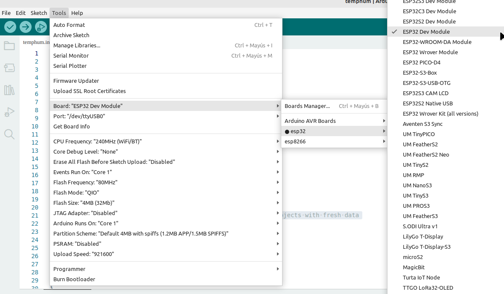
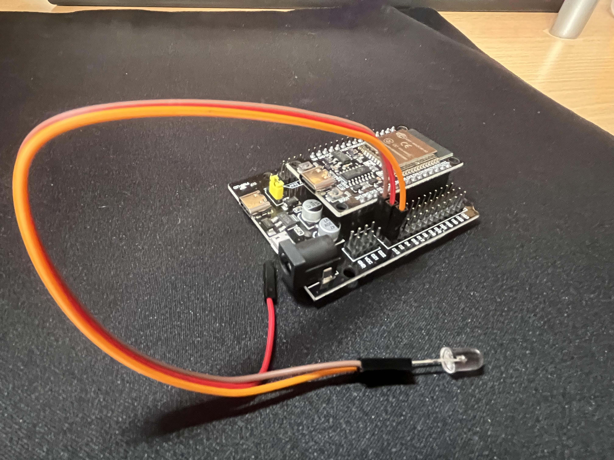
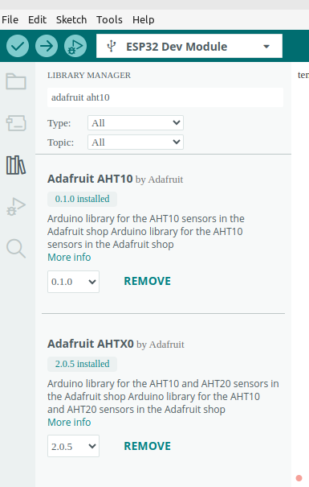
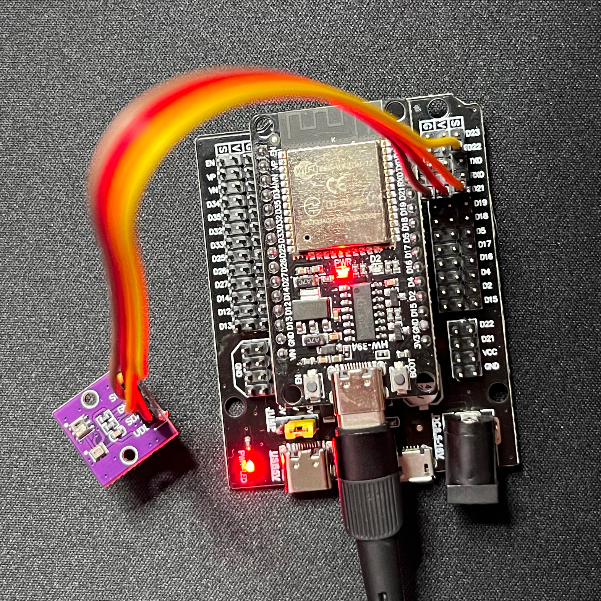
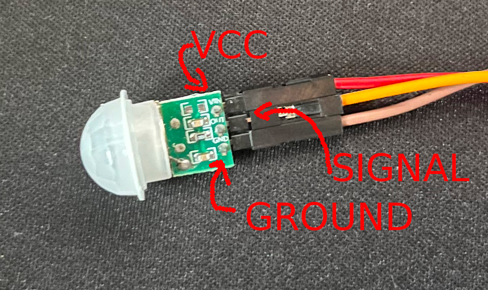
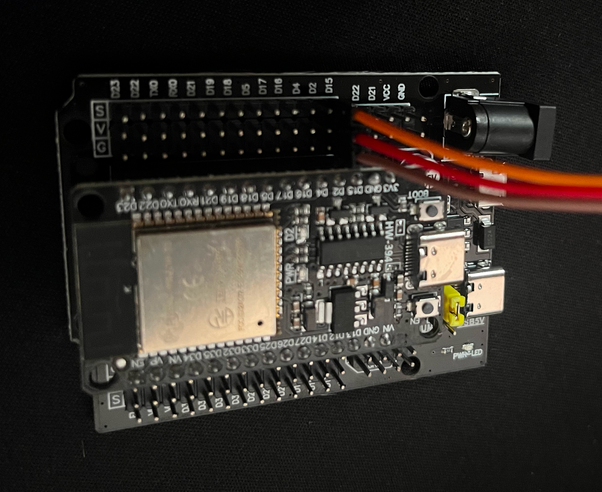

# Ejercicios de Arduino

Para esta toma de contacto, descargamos e instalamos [**ARDUINO IDE**](https://www.arduino.cc/en/software). En el caso de Linux es simplemente descargar y descomprimir, aunque debes asegurarte que tu usuario está en el grupo `serial` para poder leer el dispositivo `/dev/ttyUSB0`.

Para añadir placas adicionales de ESP32 como la que usamos nosotros (la WROOM-32), tenemos que ir al menú archivo, preferencias y en el adminitrador de placas adicionales, añadimos estas líneas: 

```bash
https://espressif.github.io/arduino-esp32/package_esp32_index.json
https://raw.githubusercontent.com/espressif/arduino-esp32/gh-pages/package_esp32_index.json
```

Ahora seleccionamos nuestra placa, `ESP32 DEV MODULE`, le decimos que está en `/dev/yyUSB0` (en linux) y ya podemos empezar a programar: Menú Tools --> Boards --> ESP32 --> ESP32 Dev Module.



## Parpadeo con un LED

Para encender y apagar un led, vamos a configurar la señal 4 como salida.



```cpp
// the setup function runs once when you press reset or power the board
void setup() {
  // initialize digital pin GPIO18 as an output.
  pinMode(18, OUTPUT);
}

// the loop function runs over and over again forever
void loop() {
  digitalWrite(18, HIGH); // turn the LED on
  delay(500);             // wait for 500 milliseconds
  digitalWrite(18, LOW);  // turn the LED off
  delay(500);             // wait for 500 milliseconds
}
```

## Sersor de luz

Conectamos el sensor de luz al puerto D34, pero lo vamos a usar en analógico. El cable que va a S en la placa de expansión, la conectamos al pin A0 del sensor.


```cpp

int count = 1;

void setup() {
  Serial.begin(9600);
}

void loop() {
  // reads the input on analog pin A0 (value between 0 and 1023)
  int analogValue = analogRead(34);
  Serial.print(count);
  count++;
  Serial.print(" th valor analógico = ");
  Serial.print(analogValue);   // the raw analog reading

  if (analogValue < 100) {
    Serial.println(" - Muy brillante");
  } else if (analogValue < 200) {
    Serial.println(" - Brillante");
  } else if (analogValue < 500) {
    Serial.println(" - Hay luz");
  } else if (analogValue < 800) {
    Serial.println(" - Casi sin luz");
  } else {
    Serial.println(" - Oscuridad");
  }

  delay(1000);
}

```

## Sensor de temperatura y humedad

Para poder usar el sensor de temperatura y humedad (AHT10) y el sensor de presión atmosférica (BMP280) necesitamos añadir unas librerías desde el gestor de librerías del IDE. Abrimos el menú contextual de la izquiera que tiene como unos libros dibujados y buscamos "ahtx". El primer resultado es la librería **Adafruit AHTX0** que es la que vamos a usar. También es posible hacerlo desde  Sketch --> Include Library --> Manage Libraries. Seguidamente añadimos también **Adafruit Unified Sensor**.



Estos chips usan el I2C para comunicarse con el controlador, luego necesitaremos conectarlo a los pines SDA y SDL que están en D21 y D22 en nuestro ESP32 WROOM como vimos en la imagen de pinout del microcontrolador en el apartado anterior. Conectamos VCC y GND cada uno en su lugar en el chip y en la placa a V y G respectivamente.



Ejemplo de lectura de humedad y temperatura:

```cpp
#include <Adafruit_AHTX0.h>

Adafruit_AHTX0 aht;

void setup() 
{
  Serial.begin(9600);
  Serial.println("Adafruit AHT10/AHT20 demo!");

  if (! aht.begin()) 
  {
    Serial.println("Could not find AHT? Check wiring");
    while (1) delay(10);
  }
  Serial.println("AHT10 or AHT20 found");
}

void loop() {
  sensors_event_t humidity, temp;
  aht.getEvent(&humidity, &temp); // leer datos de humedad y temperatura
  Serial.print("Temperature: "); 
  Serial.print(temp.temperature); 
  Serial.println(" degrees C");
  Serial.print("Humidity: "); 
  Serial.print(humidity.relative_humidity); 
  Serial.println("% rH");

  delay(1000);
}
```

Ejemplo de lectura de presión atmosférica, altitud y temperatura (en el IDE puedes encontrarlo en  File --> Examples --> Adafruit BMP280 Library --> bmp280test):

```cpp

#include <Wire.h>
#include <SPI.h>
#include <Adafruit_BMP280.h>

#define BMP_SCK  (13)
#define BMP_MISO (12)
#define BMP_MOSI (11)
#define BMP_CS   (10)

Adafruit_BMP280 bmp; // I2C
//Adafruit_BMP280 bmp(BMP_CS); // hardware SPI
//Adafruit_BMP280 bmp(BMP_CS, BMP_MOSI, BMP_MISO,  BMP_SCK);

void setup() {
  Serial.begin(9600);
  while ( !Serial ) delay(100);   // wait for native usb
  Serial.println(F("BMP280 test"));
  unsigned status;
  //status = bmp.begin(BMP280_ADDRESS_ALT, BMP280_CHIPID);
  status = bmp.begin();
  if (!status) {
    Serial.println(F("Could not find a valid BMP280 sensor, check wiring or "
                      "try a different address!"));
    Serial.print("SensorID was: 0x"); Serial.println(bmp.sensorID(),16);
    Serial.print("        ID of 0xFF probably means a bad address, a BMP 180 or BMP 085\n");
    Serial.print("   ID of 0x56-0x58 represents a BMP 280,\n");
    Serial.print("        ID of 0x60 represents a BME 280.\n");
    Serial.print("        ID of 0x61 represents a BME 680.\n");
    while (1) delay(10);
  }

  /* Default settings from datasheet. */
  bmp.setSampling(Adafruit_BMP280::MODE_NORMAL,     /* Operating Mode. */
                  Adafruit_BMP280::SAMPLING_X2,     /* Temp. oversampling */
                  Adafruit_BMP280::SAMPLING_X16,    /* Pressure oversampling */
                  Adafruit_BMP280::FILTER_X16,      /* Filtering. */
                  Adafruit_BMP280::STANDBY_MS_500); /* Standby time. */
}

void loop() {
    Serial.print(F("Temperature = "));
    Serial.print(bmp.readTemperature());
    Serial.println(" *C");

    Serial.print(F("Pressure = "));
    Serial.print(bmp.readPressure());
    Serial.println(" Pa");

    Serial.print(F("Approx altitude = "));
    /* barómetro ajustado: fuente http://www.ujaen.es/dep/fisica/estacion/estacion3.htm  */
    Serial.print(bmp.readAltitude(1022.5)); 
    Serial.println(" m");

    Serial.println();
    delay(2000);
}
```

## Buzzer (zumbador)

Para este ejemplo vamos a usar la línea 15. Conectamos tres cables en la placa de expansión (GVS) en la línea 15. Ponemos el negativo del buzzer en G, el positivo en V y la señal en S. Configuramos como salida la línea 15. Prueba este sketch. ¿Cuál es la melodía oculta?

```cpp
const int c = 261;
const int d = 294;
const int e = 329;
const int f = 349;
const int g = 391;
const int gS = 415;
const int a = 440;
const int aS = 455;
const int b = 466;
const int cH = 523;
const int cSH = 554;
const int dH = 587;
const int dSH = 622;
const int eH = 659;
const int fH = 698;
const int fSH = 740;
const int gH = 784;
const int gSH = 830;
const int aH = 880;

const int buzzerPin = 15;
int counter = 0;

void setup() {
  //Setup pin modes
  pinMode(buzzerPin, OUTPUT);
}

void loop() {

  //Play first section
  firstSection();

  //Play second section
  secondSection();

  //Variant 1
  beep(f, 250);
  beep(gS, 500);
  beep(f, 350);
  beep(a, 125);
  beep(cH, 500);
  beep(a, 375);
  beep(cH, 125);
  beep(eH, 650);

  delay(500);

  //Repeat second section
  secondSection();

  //Variant 2
  beep(f, 250);
  beep(gS, 500);
  beep(f, 375);
  beep(cH, 125);
  beep(a, 500);
  beep(f, 375);
  beep(cH, 125);
  beep(a, 650);

  delay(650);
}

void beep(int note, int duration) {
  //Play tone on buzzerPin
  tone(buzzerPin, note, duration);

  //Play different LED depending on value of 'counter'
  if (counter % 2 == 0) {

    delay(duration);

  } else {

    delay(duration);
  }

  //Stop tone on buzzerPin
  noTone(buzzerPin);

  delay(50);

  //Increment counter
  counter++;
}

void firstSection() {
  beep(a, 500);
  beep(a, 500);
  beep(a, 500);
  beep(f, 350);
  beep(cH, 150);
  beep(a, 500);
  beep(f, 350);
  beep(cH, 150);
  beep(a, 650);

  delay(500);

  beep(eH, 500);
  beep(eH, 500);
  beep(eH, 500);
  beep(fH, 350);
  beep(cH, 150);
  beep(gS, 500);
  beep(f, 350);
  beep(cH, 150);
  beep(a, 650);

  delay(500);
}
void secondSection() {
  beep(aH, 500);
  beep(a, 300);
  beep(a, 150);
  beep(aH, 500);
  beep(gSH, 325);
  beep(gH, 175);
  beep(fSH, 125);
  beep(fH, 125);
  beep(fSH, 250);

  delay(325);

  beep(aS, 250);
  beep(dSH, 500);
  beep(dH, 325);
  beep(cSH, 175);
  beep(cH, 125);
  beep(b, 125);
  beep(cH, 250);

  delay(350);
}
```

## PIR (Sensor Infrarrojo Pasivo)

Conectamos el PIN del sensor GROUND al pin G de la placa de expansión en la señal 15. Hacemos lo mismo con VCC y la línea V de la placa de expansión y finalmente la señal (línea S de la placa de expansión) va al pin de salida del sensor como se ve en las figuras:



En nuestro caso si ponermos la cabeza del sensor hacia arriba y las patillas para atrás, de izquierda a derecha tenemos: 

* **GND**: Ground o masa, el polo negativo.
* **V. IN**: V.IN o VCC, el polo positivo.
* **OUT**: La salida de la señal.



```cpp
/*
 * PIR sensor 
 */

int inputPin = 15;               // choose the input pin (for PIR sensor)
int pirState = LOW;             // we start, assuming no motion detected
int val = 0;                    // variable for reading the pin status
 
void setup() {
  pinMode(inputPin, INPUT);     // declare sensor as input 
  Serial.begin(9600);
}
 
void loop(){
  val = digitalRead(inputPin);  // read input value
  if (val == HIGH) {            // check if the input is HIGH
    
    if (pirState == LOW) {
      // we have just turned on
      Serial.println("Motion detected!");
      // We only want to print on the output change, not state
      pirState = HIGH;
    }
  } else {
    
    if (pirState == HIGH){
      // we have just turned of
      Serial.println("Motion ended!");
      // We only want to print on the output change, not state
      pirState = LOW;
    }
  }
}
```

## Conexión a WiFi


\pagebreak
